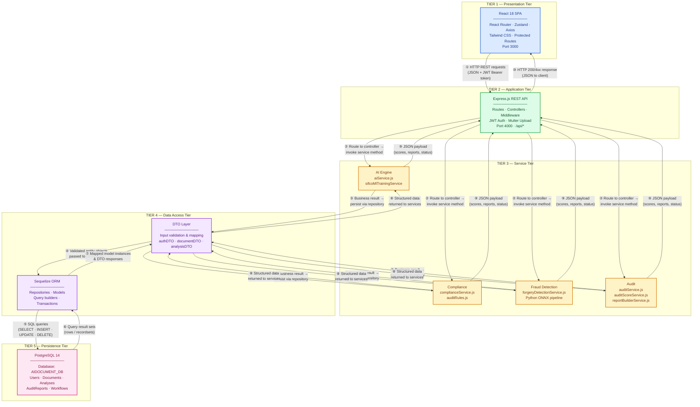

# DocAudit AI — Five-Tier Architecture Diagram

System architecture for the AI-Powered Audit Document platform, showing tier separation and labelled data flow.

---

## Five-Tier Architecture (with Data Flow)



---

## Tier Summary

| Tier | Name | Technology | Responsibility |
|------|------|------------|----------------|
| **1** | Presentation | React 18 | UI, routing, client state, API calls |
| **2** | Application | Express.js REST API | HTTP handling, auth middleware, request routing |
| **3** | Service | AI Engine · Compliance · Fraud Detection · Audit | Business logic, document analysis, scoring |
| **4** | Data Access | Sequelize ORM / DTO | Validation, entity mapping, repository pattern |
| **5** | Persistence | PostgreSQL 14 | Durable storage of users, documents, analyses, reports |

---

## Labelled Data Flow (Arrow Key)

| # | Direction | Label | Description |
|---|-----------|-------|-------------|
| ① | Presentation → Application | HTTP REST requests (JSON + JWT) | User actions (upload, audit, login) sent as REST calls |
| ② | Application → Service | Route to controller → invoke service | Express routes dispatch to the correct service module |
| ③ | Service → Data Access | Business result → persist via repository | Services write/read through DTO-validated repositories |
| ④ | Data Access (DTO → ORM) | Validated entity objects passed to ORM | DTOs sanitize input before Sequelize operations |
| ⑤ | Data Access → Persistence | SQL queries | Sequelize generates and executes SQL against PostgreSQL |
| ⑥ | Persistence → Data Access | Query result sets | PostgreSQL returns rows to Sequelize |
| ⑦ | Data Access (ORM → DTO) | Mapped model instances & DTO responses | ORM maps rows to JS objects; DTOs shape API output |
| ⑧ | Data Access → Service | Structured data returned to services | Repositories return typed data to service layer |
| ⑨ | Service → Application | JSON payload (scores, reports, status) | Services assemble business results for the controller |
| ⑩ | Application → Presentation | HTTP 200/4xx response (JSON) | Express sends final JSON response to React client |

---

## Example: Document Audit Flow Across All Five Tiers

```
React 18          Express.js         Service Tier              Data Access           PostgreSQL 14
   │                  │                    │                         │                      │
   │ POST /analysis   │                    │                         │                      │
   │ /:id/analyze ───►│ analysisController │                         │                      │
   │                  │ .analyzeDocument() │                         │                      │
   │                  │ ──────────────────►│ aiService.auditDocument │                      │
   │                  │                    │ forgeryDetectionService │                      │
   │                  │                    │ ───────────────────────►│ analysisRepository   │
   │                  │                    │                         │ .upsert() ──────────►│
   │                  │                    │                         │                      │ INSERT/UPDATE
   │                  │                    │                         │ ◄─────────────────────│ DocumentAnalysis
   │                  │                    │ ◄───────────────────────│ mapped model         │
   │                  │ ◄──────────────────│ audit result JSON       │                      │
   │ ◄────────────────│ 200 JSON response  │                         │                      │
   │  (compliance     │                    │                         │                      │
   │   score, decision)│                   │                         │                      │
```

---

*Diagram file: `FIVE_TIER_ARCHITECTURE_DIAGRAM.md` · DocAudit AI · SIFCO AE*
